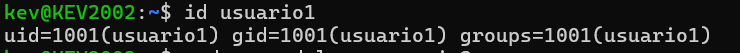
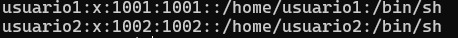
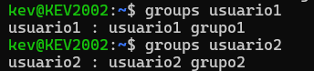
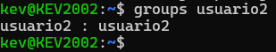
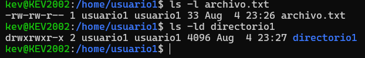
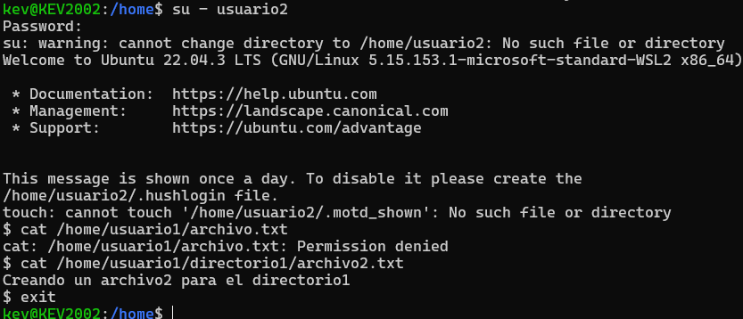
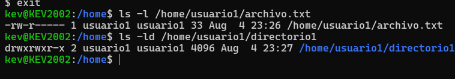

# Gestion de usuarios y permisos en linux

## P1 <-------> Gestion de usuarios

### Creacion de usuarios

``` bash 
sudo useradd usuario1
sudo useradd usuario2
sudo useradd usuario3
```
### Asignacion de contreaseña

``` bash
sudo passwd usuario1
sudo passwd usuario2
sudo passwd usuario3
``` 
### Informacion

``` bash
id usuario1
``` 


### Eliminacion de usuarios



## P2 <-------> Gestion de grupos

``` bash
sudo group grupo1
sudo group grupo2

```
### Agregar Usuarios a Grupos

``` bash
sudo usermod -aG grupo1 usuario1
sudo usermod -aG grupo2 usuario2
``` 

### Verificacion de membresia

``` bash
gruops usuario1
groups usuario2
```



### Elimnar Grupo
``` bash
sudo groupdel grupo2
```



## P3 <-------> Gestion de permisos

### Creacion del directorio principal para el "usuario1"

``` bash 
sudo mkdir /home/usuario1
sudo chown usuario1:usuario1 /home/usuario1
sudo chmod 755 /home/usuario1

```
### Creacion de archivos y directorios

``` bash 
su - usuario1
echo "Contenido" > archivo.txt
mkdir directorio1
echo "Contenido" > directorio1/archivo2.txt
exit

```
### Verificacion de permisos
``` bash 
ls -l archivo1.txt
ls -ld directorio1
```



### Modificar permisos usando chmod con modo numerico
``` bash 
sudo chmod 640 /home/usuario1/archivo.txt
```

### Modificar permisos usando modo simbolico

``` bash 
sudo chown :grupo1 /home/usuario1/directorio1/archivo2.txt
```

### Confirmar permisos de directorio
``` bash 
chmod 740 /home/usuario1/directorio1
```

### Comprobacion de acceso

``` bash 
su - usuario2
cat /home/usuario1/archivo.txt 
cat /home/usuario1/directorio1/archivo2.txt
exit
```


### Verificacion final



