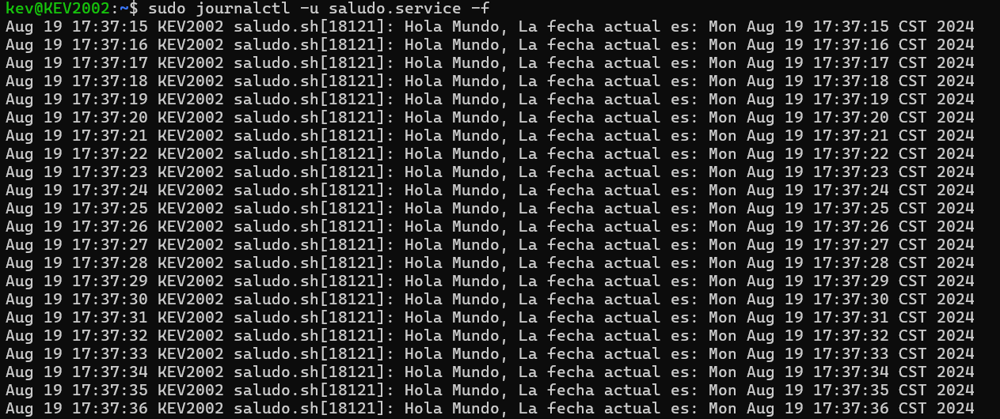

# SERVICIO DE SALUDO

Este servicio ejecuta un script que imprime un saludo y la fecha actual cada segundo.

## Instalacion

1. Crear un script .sh con las instrucciones que realizara la accion de imprimir un saludo con la fecha actual cada segundo o bien copiar el script que acontinuacion se te presenta.

``` bash
#!/bin/bash

while true; do
    echo "Hola! La fecha actual es: $(date)"
    sleep 1
done
```

2. Una vez creado o copiado el scriptasegurate de darle permiso  al script para que este sea ejecutable, aca muestro un ejemplo de como hacerlo(Yo nombre al script como saludo.sh) .

``` bash
sudo chmod +x /usr/local/bin/saludo.sh

en este caso la ubicacion tiene que ser donde tengas el script o donde lo hallas guardado
```

3. Posteriormente debes de crear un archivo de servicion en "/etc/systemd/system/" llamandolo saludo.service(o como desees) en este caso lo nombre igual al archivo .sh para tener un mejor control.

4. Abre un editor como superusuario de la siguiente manera.

``` bash
sudo nano /etc/systemd/system/saludo.service
```

5. Añade el siguiente contenido.

``` bash 
[Unit]
Description=Servicio de saludo que imprime la fecha cada segundo
After=network.target

[Service]
ExecStart=/usr/local/bin/saludo.sh // Aca va la ubicacion donde tienes el archivo saludo.sh, ya sea la ruta relativa o absoluta
Restart=always

[Install]
WantedBy=multi-user.target
```

6. Recargar el "systemd" con el siguien comando.

``` bash 
sudo systemctl daemon-reload
```

7. Habilitar el servicio para que se inicie automaticamente al cargar el sistema de la siguiente manera.

``` bash 
sudo systemctl enable saludo.service
```

8. Inicia el servicio con el siguiente comando.

``` bash 
sudo systemctl start saludo.service
```

9. Para ver los logs del servicio ingresar el siguiente comando.

``` bash 
sudo journalctl -u saludo.service -f
```

Y listo con esto tendras un servicio que imprimira un mensaje de Hola mundo con la fecha actual cada segundo.


